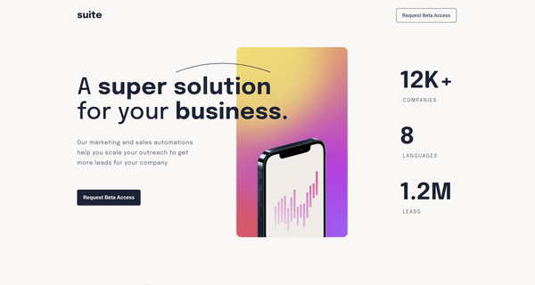
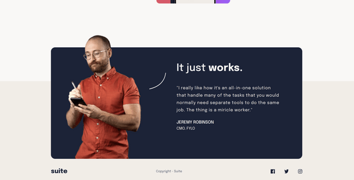

# Frontend Mentor - Suite landing page solution

This is a solution to the [Suite landing page challenge on Frontend Mentor](https://www.frontendmentor.io/challenges/suite-landing-page-tj_eaU-Ra). Frontend Mentor challenges help you improve your coding skills by building realistic projects.

## Table of contents

- [Overview](#overview)
  - [The challenge](#the-challenge)
  - [Screenshot](#screenshot)
  - [Links](#links)
- [My process](#my-process)
  - [Built with](#built-with)
  - [What I learned](#what-i-learned)
  - [Continued development](#continued-development)
  - [Useful resources](#useful-resources)
- [Author](#author)

## Overview

### The challenge

Users should be able to:

- View the optimal layout depending on their device's screen size
- See hover states for interactive elements

### Screenshot

### Links

- Solution URL: [Github Repo](https://github.com/PeshwariNaan/suite-landing-page
- Live Site URL: [Live Link](https://peshwarinaan.github.io/suite-landing-page/)

## My process

### Built with

- Semantic HTML5 markup
- Flexbox
- CSS Grid
- Mobile-first workflow
- Sass

### What I learned

The major points for me in this project was learning how to use css filters to manipulate colors on svg images and learning how to make better use of grid orientaions for different screen sizes. I feel I got a lot of practice in 

### Continued development

I really want to speed up the process with writing css code. I get a littel frustrated when seemingly simple tasks take a lot of time, it feels very inefficient. 

### Useful resources

- [Filter tricks](https://css-tricks.com/almanac/properties/f/filter/) - This site is great to see what all the different filters can do with having the painful experience of trial and error in the code editor. Very useful
- [Css grid](https://css-tricks.com/snippets/css/complete-guide-grid/) - Great reference for css grid and flex-box
- [Css flex-box](https://css-tricks.com/snippets/css/a-guide-to-flexbox/)

## Author

- Frontend Mentor - [@PeshwariNaan](https://www.frontendmentor.io/profile/PeshwariNaan)

